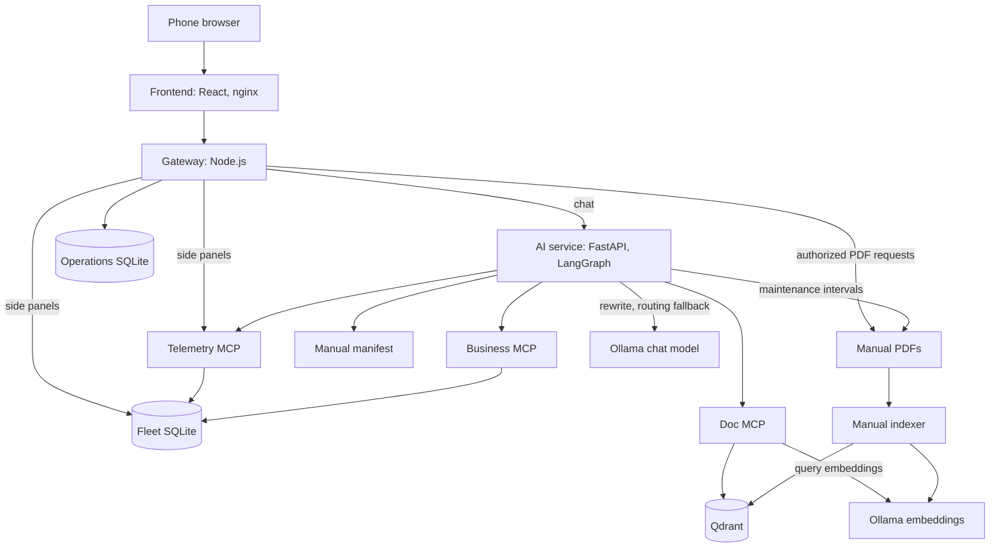
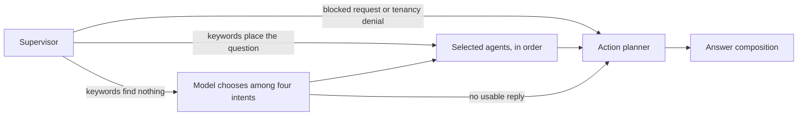
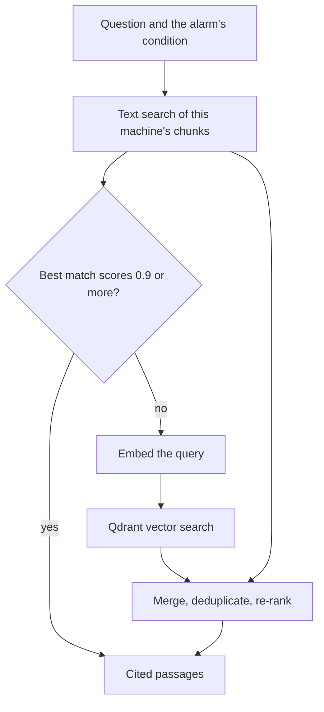
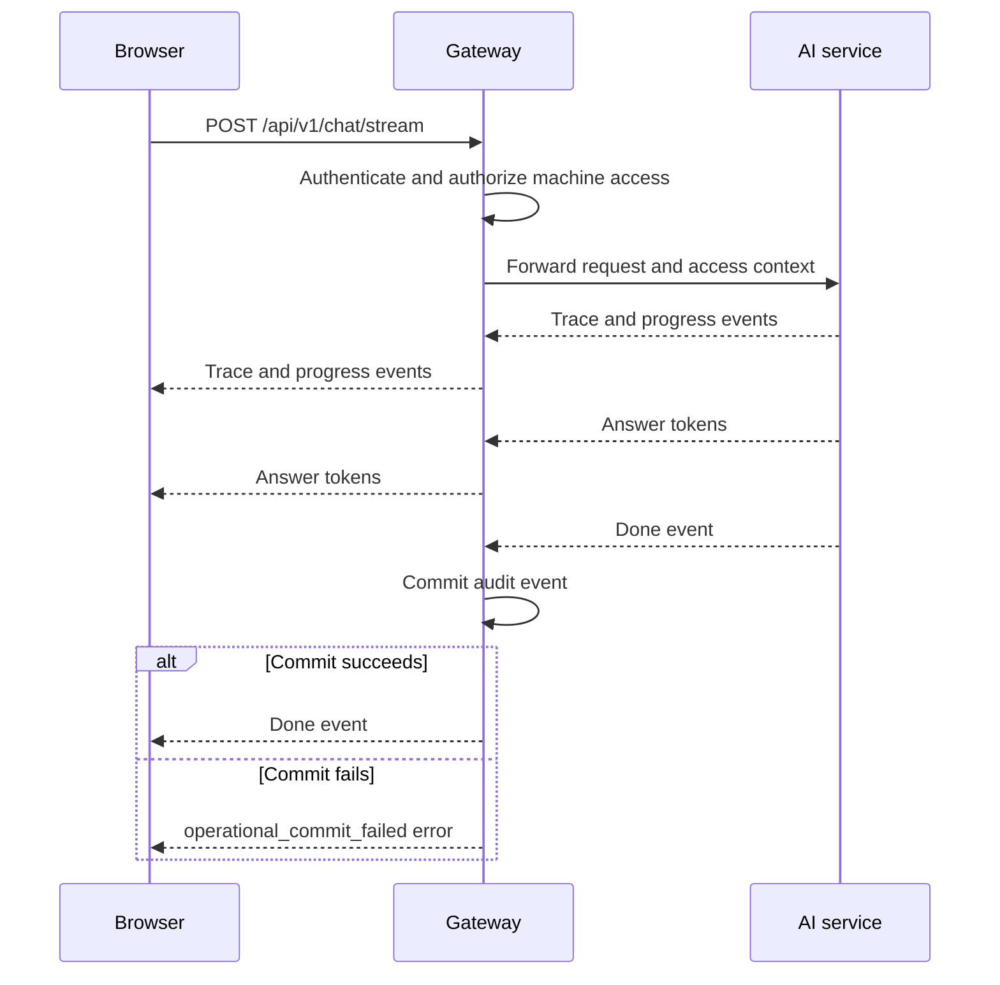

# AROL Service Portal: design and evaluation

Project Q2 is about a customer platform where scanning the QR code on a machine
opens that machine's manual, together with a chatbot that answers by handing
the question to specialized agents: one for the PDF manuals, one for IoT
telemetry, and one for orders and contracts. This
prototype builds that on the supplied dataset: 5 companies,
8 machines and their 8 manuals, 5,760 hourly telemetry snapshots, 260 alarms,
65 maintenance tickets, and the quotes and orders behind them.

This document covers the ideas behind the design, the main choices and what
each one costs, how the system was evaluated, and where it falls short. How to
run it is in [README.md](README.md).

## Architecture

The **gateway** is the only service the browser talks to. It signs users in, checks company and visibility on every
request, rate-limits, writes the audit log, and serves manual PDFs only for
machines the user may open. It also feeds the side panels (fleet list, machine
details, alarms, maintenance, quotes) directly from SQLite and Telemetry MCP,
so they load, even while the model is still writing. It uses Node's built-in
HTTP and SQLite modules.

The **AI service** runs the LangGraph workflow. It never reads the database, so
machine identity comes from the manual manifest, and records come through the MCP servers.

The **three MCP servers** each own one data source and expose read-only tools
over JSON-RPC, authenticated with a shared secret.

## Design choices

### 1. The answer is composed then the LLM model only rewrites it

The answer node assembles a structured draft from what the agents found:
telemetry, the alarm's meaning, a manual summary with its citation,
maintenance, commercial records, a next step, and anything withheld. The
configured provider then decides what reaches the user:

| Provider           | What happens to the composed answer                     |
|--------------------|---------------------------------------------------------|
| `deterministic`    | Sent unchanged                                          |
| `ollama` (default) | Rewritten by the local LLM model, `qwen2.5:3b-instruct` |

Three kinds of answers are never rewritten: questions about restarting a
stopped machine or whether that is safe, answers containing a safety-critical
diagnostic step, and answers where part of the request was refused for access
reasons. If the model call fails or times out (a fixed 45 seconds), the
composed answer is sent instead, and the failure is recorded in the answer's
tool trace.

**Why.** Every figure, date, and page in an answer can be traced to a record.
The evaluation measures retrieval and access control rather than a model's
variability. And the system gives complete answers on a machine with no GPU.

**Cost.** A rewrite still loses information. Composed answers read like structured reports rather than
conversation. On CPU, a rewrite takes tens of seconds.

### 2. Keyword routing, with the model as a fallback

The supervisor classifies each question with keywords and regular expressions
(`graph/edges.py`) into four intents: documentation, telemetry,
troubleshooting, and business. It then runs the necessary agents in a
fixed order, so troubleshooting can use what the manual and telemetry agents
found.

| Order | Agent                 | Responsibility                                                                      |
|-------|-----------------------|-------------------------------------------------------------------------------------|
| 1     | Doc agent             | Searches this machine's manual through Doc MCP                                      |
| 2     | Telemetry agent       | Latest readings, active alarms, alarm history                                       |
| 3     | Troubleshooting agent | Turns manual and telemetry evidence into diagnostic steps, each with a safety level |
| 4     | Business agent        | Quotes, orders, entitlement, maintenance history, and the maintenance-due estimate  |

When the keywords find nothing machine-related, the supervisor asks the model
to choose among the four intents, with a short prompt of worked examples
(`graph/llm_router.py`). The guardrail and the restart-safety check have
already run by then, and a reply that is not a clean list of labels is
discarded.

**Why.** Keyword routing is reproducible, it has a low cost (in comparison to a call to the LLM), and keeps every
safety decision out of the model's hands. The fallback exists because some prompts can have typos or be in a different language, and they would be blocked.

**Cost.** A question whose keywords point at the wrong agent is still
misrouted. The fallback adds one model call, though only to questions that
would otherwise be refused, and the vocabulary has to grow as real phrasing is
discovered.

Two prompts reach a model: `ai-service/src/arol_ai/prompts/answer_synthesizer.md`
for rewriting answers, and the routing prompt inside `graph/llm_router.py`. The
other four files in `prompts/` describe each agent's job.

### 3. Access control in layers

Access needs both a matching company and permission for the data's domain:

| Domain      | Contents                         | full | technician | commercial |
|-------------|----------------------------------|:----:|:----------:|:----------:|
| Common      | Machines, models, manuals        | yes  |    yes     |    yes     |
| Operational | Telemetry, alarms, maintenance   | yes  |    yes     |     no     |
| Commercial  | Quotes, revisions, lines, orders | yes  |     no     |    yes     |

The gateway checks both on every request.
Before fetching any records, the AI service looks the machine up in the manifest and checks that it belongs to the user's
company, and anything the user's role cannot see is dropped from the request.
The graph checks the company again before any agent runs, and each agent checks
its own domain. Maintenance tickets are served by Business MCP but belong to
the operational domain, so answers for commercial users leave out maintenance
dates and ticket counts.

The gateway distinguishes missing resources from denied access:

| Condition                                 | HTTP status and code         |
|-------------------------------------------|------------------------------|
| Signed out or session expired             | `401 session_expired`        |
| Cookie request without a valid CSRF token | `403 csrf_required`          |
| Unknown machine                           | `404 machine_not_found`      |
| Missing company                           | `403 company_unknown`        |
| Another company's machine                 | `403 machine_not_in_company` |
| Missing or invalid visibility             | `403 visibility_unknown`     |
| Restricted domain                         | `403 visibility_denied`      |
| Machine outside the allowlist             | `403 machine_not_allowed`    |

**Why.** A single check at the edge would turn any bug further in into a data
leak. Checking before retrieval also means the model never sees withheld data,
so it cannot repeat it.

**Cost.** The MCP servers trust the user context the AI service forwards with
the shared secret. In a production deployment, the MCP servers should verify the user's
token themselves.

### 4. Manual retrieval, one machine at a time

Manuals are bound to machines by serial number. Each page of the manual
is split into 1,200-character chunks overlapping by 160, and every chunk keeps
its machine ID, file, and page. Every search is filtered to one machine.

Both passes read the same Qdrant collection. A strong text match ends the
search without an embedding call.

Some manuals never print the dataset's alarm codes, such as
`AL017_LOW_AIR_PRESSURE`; therefore, we must also search for the
code names ("low air pressure"), which finds the manual's own description of
it. When nothing matches, the answer says the manual has no passage for it and
relies on the alarm history for the users who can see it.

### 5. Estimating when maintenance is due

For a maintenance-due question, the
business agent reads up to 1,440 hourly telemetry snapshots (60 days) and adds
up uptime to estimate productive hours. It compares that estimate with each
interval in the machine's manual ("every 40 working hours" and so on) and
cites the page.

### 6. Streaming, sessions, and state

Chat replies stream as Server-Sent Events. Progress events arrive as each
graph node completes, and the answer follows once the graph has finished. The
gateway commits the audit event before it sends the final event.

| State                                                     | Where it lives                                                          |
|-----------------------------------------------------------|-------------------------------------------------------------------------|
| Sign-in sessions                                          | Gateway `operations.sqlite`; kept across restarts                       |
| Audit events and alerts                                   | Gateway `operations.sqlite`; kept 365 and 90 days                       |
| Rate-limit counters                                       | Gateway memory                                                          |
| Conversation history                                      | AI-service memory; 8 hours, at most 100 messages and 512 KB per session |
| Graph checkpoints                                         | AI-service memory                                                       |
| Idempotency records, so a resent request is answered once | AI-service memory                                                       |

Everything in AI-service memory is lost on restart. To run more than one replica, we would need a shared session using a Redis database.

### 7. The interface

The app opens on the fleet of the user's company. The gateway sends the
browser only those machines. A machine's workspace shows its identity and
status, the active alarm with a button that starts troubleshooting, suggested
questions, and the streaming chat with the sources of each answer. The manual
opens over the conversation with search, zoom, and page numbers.
Troubleshooting appears as a list of steps the operator works through. An
account card shows who is signed in and what their role can see. The app can
be installed on a phone's home screen. Its service worker keeps the app itself
available without a connection, but it never caches data or manuals: those
always come from the gateway, which checks access on every request.

The QR code on each machine encodes `/machines/<serialNumber>`; the route also
accepts machine IDs. A QR visit keeps its target machine through sign-in and
then opens that workspace.

## Stack used

| Component       | Built with                                         |
|-----------------|----------------------------------------------------|
| Frontend        | React 19, MUI, TypeScript, Vite                    |
| Gateway         | Node.js 22, built-in HTTP and SQLite, no framework |
| AI service      | Python, FastAPI, LangGraph, PyMuPDF, qdrant-client |
| MCP servers (3) | Python standard library, JSON-RPC over HTTP        |
