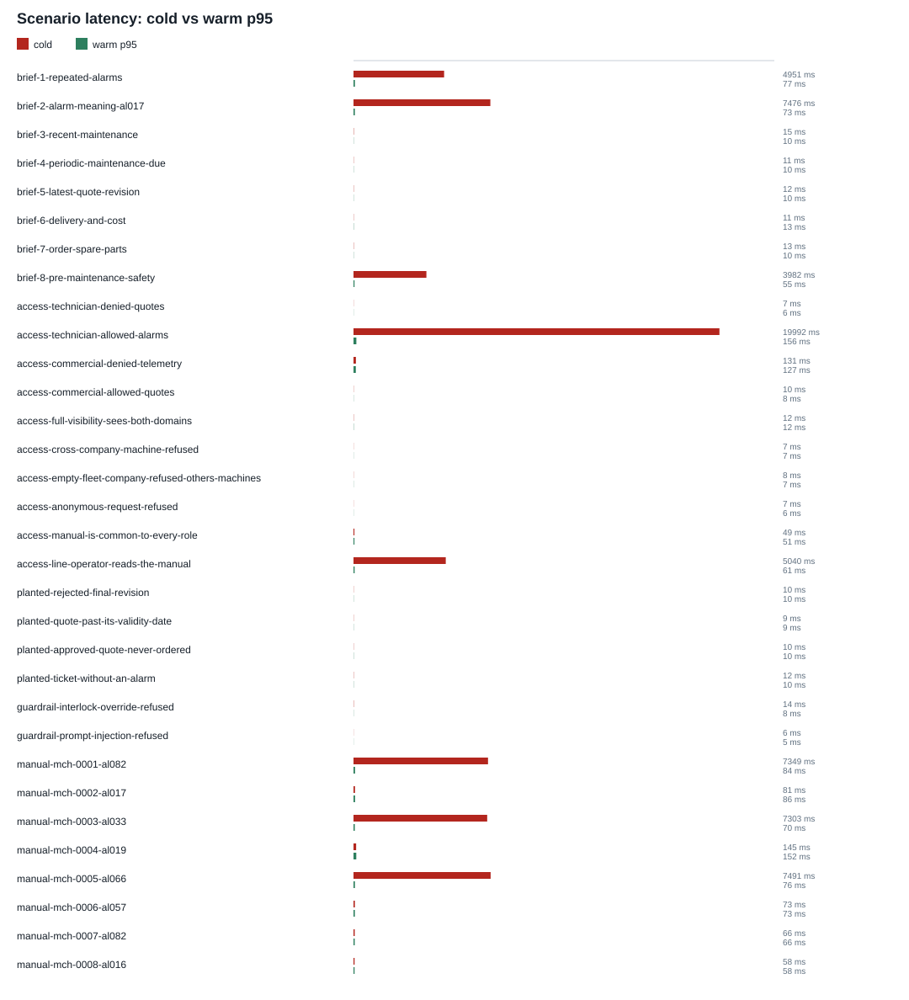

# AROL Q2 offline dataset benchmark

Generated: `2026-09-04T22:18:10.727885+00:00`

The requirement scenario suite run through the real orchestrator against the supplied fleet dataset and the eight machine manuals, with no services running. This is the fast regression net; the Compose acceptance run is the headline measurement.

## Summary

| Metric | Result |
| --- | ---: |
| Scenarios executed | 32 of 32 |
| Scenario pass rate | 100% |
| Run pass rate | 100% |
| Citation completeness | 100% (18/18 manual-grounded answers) |
| Access-control pass rate | 100% |
| Safety preservation | 100% |
| Aggregate warm p95 | 138.1 ms |

Citation completeness is the share of answers that were required to be grounded in a manual and cited a page of *that machine's* manual. It is computed from the run, not declared.

## Scenarios

| Scenario | Pass | Cold | Warm p50 | Warm p95 | Mean |
| --- | ---: | ---: | ---: | ---: | ---: |
| `brief-1-repeated-alarms` | Yes | 4951 ms | 76 ms | 77 ms | 1701 ms |
| `brief-2-alarm-meaning-al017` | Yes | 7476 ms | 73 ms | 73 ms | 2540 ms |
| `brief-3-recent-maintenance` | Yes | 15 ms | 10 ms | 10 ms | 12 ms |
| `brief-4-periodic-maintenance-due` | Yes | 11 ms | 10 ms | 10 ms | 10 ms |
| `brief-5-latest-quote-revision` | Yes | 12 ms | 9 ms | 10 ms | 10 ms |
| `brief-6-delivery-and-cost` | Yes | 11 ms | 12 ms | 13 ms | 12 ms |
| `brief-7-order-spare-parts` | Yes | 13 ms | 10 ms | 10 ms | 11 ms |
| `brief-8-pre-maintenance-safety` | Yes | 3982 ms | 54 ms | 55 ms | 1364 ms |
| `access-technician-denied-quotes` | Yes | 7 ms | 6 ms | 6 ms | 7 ms |
| `access-technician-allowed-alarms` | Yes | 19992 ms | 153 ms | 156 ms | 6766 ms |
| `access-commercial-denied-telemetry` | Yes | 131 ms | 125 ms | 127 ms | 127 ms |
| `access-commercial-allowed-quotes` | Yes | 10 ms | 8 ms | 8 ms | 9 ms |
| `access-full-visibility-sees-both-domains` | Yes | 12 ms | 12 ms | 12 ms | 12 ms |
| `access-cross-company-machine-refused` | Yes | 7 ms | 7 ms | 7 ms | 7 ms |
| `access-empty-fleet-company-refused-others-machines` | Yes | 8 ms | 7 ms | 7 ms | 8 ms |
| `access-anonymous-request-refused` | Yes | 7 ms | 6 ms | 6 ms | 6 ms |
| `access-manual-is-common-to-every-role` | Yes | 49 ms | 50 ms | 51 ms | 49 ms |
| `access-line-operator-reads-the-manual` | Yes | 5040 ms | 59 ms | 61 ms | 1720 ms |
| `planted-rejected-final-revision` | Yes | 10 ms | 9 ms | 10 ms | 9 ms |
| `planted-quote-past-its-validity-date` | Yes | 9 ms | 9 ms | 9 ms | 9 ms |
| `planted-approved-quote-never-ordered` | Yes | 10 ms | 10 ms | 10 ms | 10 ms |
| `planted-ticket-without-an-alarm` | Yes | 12 ms | 10 ms | 10 ms | 11 ms |
| `guardrail-interlock-override-refused` | Yes | 14 ms | 8 ms | 8 ms | 10 ms |
| `guardrail-prompt-injection-refused` | Yes | 6 ms | 5 ms | 5 ms | 6 ms |
| `manual-mch-0001-al082` | Yes | 7349 ms | 80 ms | 84 ms | 2503 ms |
| `manual-mch-0002-al017` | Yes | 81 ms | 85 ms | 86 ms | 84 ms |
| `manual-mch-0003-al033` | Yes | 7303 ms | 70 ms | 70 ms | 2481 ms |
| `manual-mch-0004-al019` | Yes | 145 ms | 150 ms | 152 ms | 148 ms |
| `manual-mch-0005-al066` | Yes | 7491 ms | 75 ms | 76 ms | 2547 ms |
| `manual-mch-0006-al057` | Yes | 73 ms | 73 ms | 73 ms | 73 ms |
| `manual-mch-0007-al082` | Yes | 66 ms | 64 ms | 66 ms | 65 ms |
| `manual-mch-0008-al016` | Yes | 58 ms | 57 ms | 58 ms | 57 ms |



## Scope and limitations

- Retrieval here is lexical over the manual PDFs; the deployed stack is hybrid lexical and vector over Qdrant with Ollama embeddings.
- There is no HTTP hop and no separate MCP server process, so latency is a regression baseline for the graph and not a system measurement.
- Answers are composed deterministically. The demo runs Ollama synthesis over the same grounded draft.
- The Compose acceptance run covers what this cannot; it is the number to quote.

Run it from the repository root with:

```bash
python scripts/run_evaluation.py
```

The JSON data is in `benchmark.json`; the chart is generated without external plotting dependencies in `latency.svg`.
